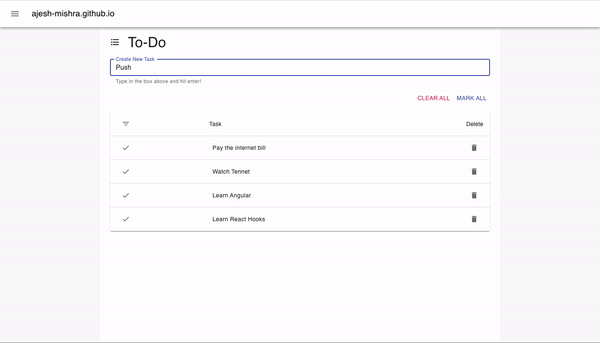

# react-material-app
This is a simple To-Do App built with **React** and **Material UI**.


# Usage

* Install Dependencies
```
$ npm install
```
* Start the application
```
$ npm start
```
* App should launch automatically on http://localhost:3000/
